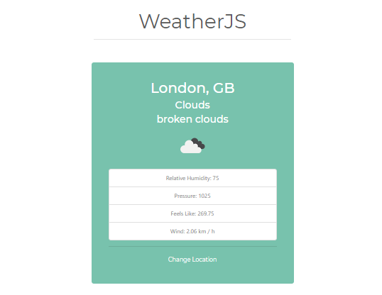

# WeatherJS

> Vanilla JS project for fetching weather data from openweather api

Simple project built after Brad Traversy's course. Includes. Main point was to sharp vanilla js skills and use fetch api.

_Live demo: [weatherjs-alpha.netlify.app](https://weatherjs-alpha.netlify.app/)_

## Release History

- 0.0.1
  - Simple functionality, weather data from openweather api

## Contributing

1. Fork it (<https://github.com/jorgadev/weatherjs/fork>)
2. Create your feature branch (`git checkout -b feature/fooBar`)
3. Commit your changes (`git commit -am 'Add some fooBar'`)
4. Push to the branch (`git push origin feature/fooBar`)
5. Create a new Pull Request
